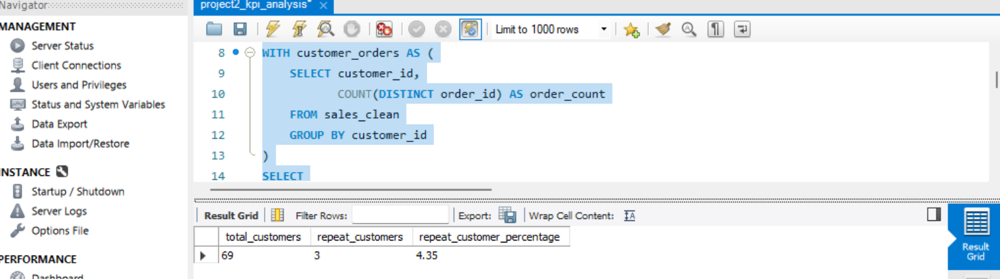
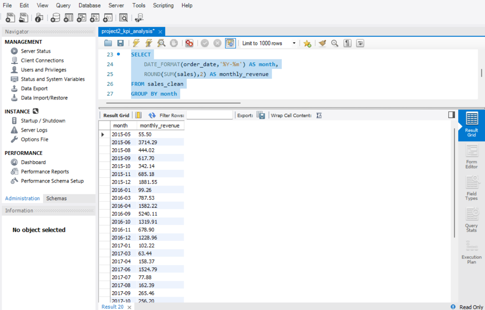
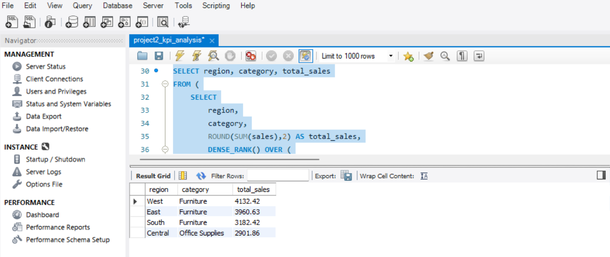

# Customer Revenue KPI Analysis (SQL)

## Executive Summary

This analysis evaluates revenue performance, customer retention, and operational efficiency using retail transaction data.

Key findings:
- Total revenue: 28,609.93 across 72 orders.
- Repeat customer rate is 4.35%, indicating weak customer retention.
- Revenue shows volatility with spikes in late 2016.
- Furniture drives the highest revenue across most regions.
- Standard shipping averages 5.09 days, more than double First Class (2.19 days).

The business appears revenue-generating but retention-poor, with potential operational optimization opportunities.

---

## Project Overview

This project analyzes retail transaction data using **SQL (MySQL)** to evaluate modern business performance metrics such as customer retention, revenue growth, and operational efficiency.

The analysis simulates real-world analytics tasks performed by data analysts in e-commerce and retail organizations.

---

## Business Questions Answered

* What is the total revenue and average order value?
* How many customers are repeat buyers?
* How does revenue change month-to-month?
* Which product category performs best in each region?
* How efficient is shipping performance across delivery modes?

---

## Tools & Technologies

* SQL (MySQL Workbench)
* Window Functions
* Aggregations & KPI Calculations
* GitHub for project documentation

---

## Key KPIs Generated

* Total Revenue
* Total Orders
* Total Customers
* Average Order Value (AOV)
* Repeat Customer Percentage
* Monthly Revenue Trend
* Operational Shipping Performance

---

## Project Structure

```
customer-revenue-kpi-analysis/
│
├── sql/
│   └── project2_kpi_analysis.sql
│
├── images/
│   ├── kpi_summary.png
│   ├── repeat_customers.png
│   ├── monthly_revenue.png
│   ├── best_category_region.png
│   └── shipping_speed.png
│
└── README.md
```

---

## Analysis Approach

1. Cleaned and structured retail sales data.
2. Designed SQL queries to compute business KPIs.
3. Applied aggregation and window functions for advanced insights.
4. Exported analytical outputs for reporting and dashboard usage.

---

## What This Project Demonstrates

* Advanced SQL querying skills
* KPI and business metric design
* Customer retention analysis
* Revenue trend analysis
* Operational performance evaluation
* End-to-end analytics workflow

---

## Business Impact

This project demonstrates how SQL analysis can support:

- KPI monitoring for business performance
- Customer retention evaluation
- Revenue growth tracking
- Operational efficiency improvement
- Data-driven strategic decision making

---

## Recommended Business Actions

Based on the analysis:

- Improve customer retention through loyalty programs or targeted re-engagement campaigns.
- Investigate causes of low repeat purchase behavior.
- Focus inventory investment on high-performing regional categories.
- Evaluate logistics improvements to reduce Standard Class shipping delays.
- Monitor monthly revenue volatility to stabilize forecasting and planning.

---

## Key Insights

- Revenue was generated across 72 total orders, indicating moderate transaction volume.
- Customer retention is low (4.35% repeat rate), suggesting dependence on new customers.
- Revenue fluctuations suggest potential seasonality or inconsistent demand.
- Furniture products consistently outperform other categories across regions.
- Delivery speed varies significantly by shipping mode, impacting customer experience.

---

## Query Results (Evidence)

## KPI Results

### KPI Summary


### Repeat Customer Analysis


### Monthly Revenue Trend


### Best Category by Region


### Shipping Speed Analysis


---

## Skills Demonstrated

- SQL Data Analysis
- KPI Development & Business Metrics
- Window Functions & Aggregations
- Customer Retention Analysis
- Operational Performance Analysis
- Analytical Storytelling

---

## Author

Meena Potlacheruvu
Data Analytics Portfolio Project
